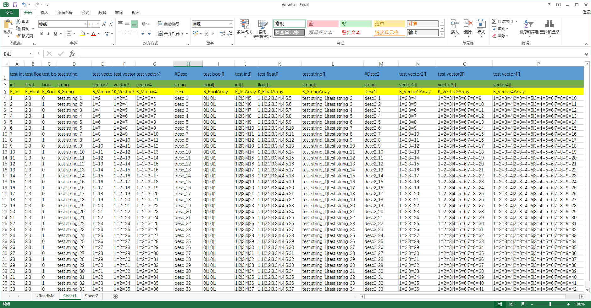
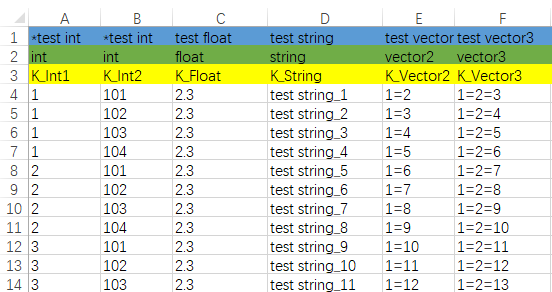
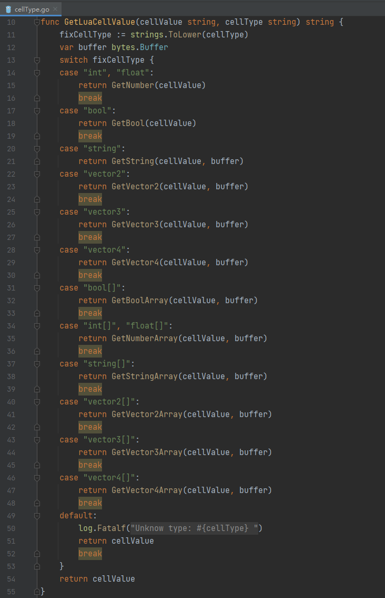

# OneExcel
OneExcel是使用Go语言开发，导出文件为lua配置表文件，支持双Key。

## Excel库

Go语言的Excel处理库还是挺多的，目前选用了xlsx作为Excel处理库

```text
github.com/tealeg/xlsx
```

## 规则定义




针对Excel导出lua文件制定了如下规则：

1. Excel的Sheet名字前面带有#字符的忽略导出 (图中的”#ReadMe“ Sheet忽略导出)
2. Excel的第一行是字段的描述说明，第二行是字段类型，第三方是字段名字。从第四行开始四字段的内容。
3. 支持的数据类型：int、float、bool、string、Vector2、Vector3、Vector4
4. 支持的类型数组：bool[]、int[]、float[]、string[]、Vector2[]、Vector3[]、Vector4[]
5. Excel的第一行的字段描述的开头如果以#开头，那么该列就不会作为有效数据导出，便于策划在数据后面添加注释说明。
6. 双Key：如果想要导出的数据支持双Key，只需要在Excel的第一行的字段前面以*开头即可，两个Key都要加上标注。




如上图” *test int “ 和 ”* test int “

## 扩展

### config.go

在config.go文件里面定义了Excel的源目录

```text
const EXCEL_DIR = "./Excels/"
const HEAD_SHEET_INGORE = "#"
const HEAD_CELL_KEY = "*"
```

以及excel的数据结构

```text
type SheetData struct {
    SheetName  string
    HeadLength int

    DescList    []string
    KeyTypeList []string
    KeyNameList []string

    HasTwoKey bool
    //Two key
    KeyValueList [][]string
}
```

每一个Sheet都有上面的结构, 有需要可以自己修改里面的内容。

### xlsx.go

xlsx.go文件里面包含了对excel文件的读取，会返回结构为SheetData的数组

### luaUtil.go

luaUtil.go文件里面是编写导出的lua文件（包含大括号、头部包含Key的table等等）

### cellType.go

cellType.go文件里面是针对各种数据类型对应的导出格式的封装。





### main.go

main.go文件的main函数里面就是根据Excel目录一键导出所有的lua配置文件。

## 下载地址

[oneexcel](https://link.zhihu.com/?target=https%3A//github.com/onelei/oneexcel) 欢迎Start~~~